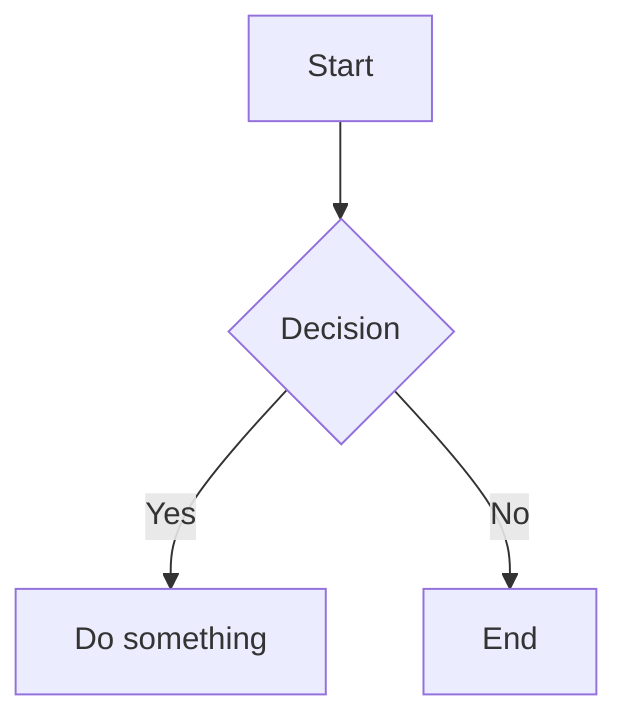

A list of obsidian syntax manual.

<!--truncate-->

Here's a solid rundown of Obsidian syntax tricks, grouped by how useful they tend to be:

---

## Text Formatting

Obsidian uses standard Markdown plus its own extensions. The basics:

|What|Syntax|
|---|---|
|Bold|`**text**`|
|Italic|`*text*`|
|Bold + Italic|`***text***`|
|Strikethrough|`~~text~~`|
|**Highlight**|`==text==`|
|Inline code|`` `code` ``|

The `==highlight==` syntax is Obsidian-specific — very handy for study notes.

---

## Linking (the core power of Obsidian)

Wikilinks use double brackets to create internal links: `[[Note Name]]`. To display different text than the note name: `[[Note Name|Display Text]]`.

You can link to a specific heading within a note: `[[Note Name#Heading]]`, or within the same note: `[[#Heading]]`. You can also link to any paragraph — Obsidian lets you type `[[Note Name#^` and it suggests available blocks.

---

## Embeds

Embedding pulls content from one note into another — if you update the source, the embedded version updates too:

- Embed entire note: `![[Note Name]]`
- Embed a specific heading: `![[Note Name#Heading]]`
- Embed image with size: `![[image.png|300]]`

The `!` before the brackets is what triggers embedding versus just linking.

---

## Callouts

One of the most visually useful tricks. Basic syntax:

```
> [!note]
> This is a note callout.
```

With a custom title:

```
> [!tip] Remember This
> Callouts can have custom titles.
```

Built-in types include `note`, `tip`, `warning`, `success`, `question`, `danger`, `example`, `quote`, and more — each with its own color.

You can make them foldable too — add `-` (collapsed by default) or `+` (expanded) after the type:

```
> [!warning]- Click to expand
> Hidden content here.
```

This creates accordion-style sections.

Examples:
> [!warning]
> The is a test warning **callout**.

> [!note] note callout
> Contents

> [!tip] Tip callout
> Contents

---

## Comments (Hidden Text)

Obsidian supports hidden comments that only appear in editing mode:

```
%% This won't show in preview. %%
```

You can also use it as a block. Useful for leaving notes-to-self without cluttering the published view.

---

## Tags with Hierarchy

Nested tags use forward slashes to create hierarchies:

```
#project/website
#status/active
```

Searching `tag:#project` returns all notes with `#project` and any subtag beneath it.

---

## YAML Frontmatter (Properties)

Add metadata at the very top of a note (no blank lines above it):

```yaml
---
title: My note
date: 2026-09-22
tags:
  - project
status: active
---
```

Obsidian shows this as a clean Properties panel. It pairs really well with the Dataview plugin to query notes like a database.

---

## Footnotes

```
Here's a claim[^1].

Or inline: Here's a claim^[This appears as a footnote].

[^1]: Footnote content here.
```

Obsidian renders all footnotes at the bottom in preview mode.

---

## Mermaid Diagrams

Obsidian supports Mermaid diagrams natively inside fenced code blocks — no plugins needed:



Supports flowcharts, sequence diagrams, Gantt charts, pie charts, and more.

---

## LaTeX Math

Inline math uses single dollar signs: `$x = \frac{-b \pm \sqrt{b^2}}{2a}$`

Block math uses double:

```
$$
\sum_{i=1}^{n} i = \frac{n(n+1)}{2}
$$
```

```
$$
\sum_{i=1}^{n} i = \frac{n(n+1)}{2}
$$
```

---

The ones most people find immediately useful: **callouts**, **wikilinks with aliases**, **hidden comments**, and **nested tags**. The YAML frontmatter + Dataview combo is a rabbit hole worth going down if you ever want to turn your vault into a structured knowledge base.

